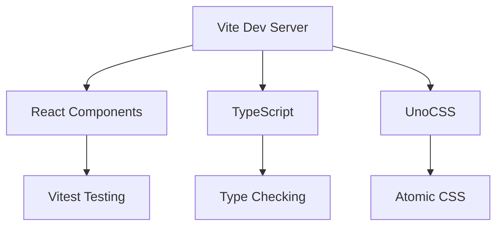

# Introduction to Vite-React

Vite-React is our optimized React framework that combines:
- ⚡ Vite - Next generation frontend tooling
- 🚀 React 18 with concurrent features
- 🛠 TypeScript support out of the box
- 🎨 UnoCSS for utility-first styling
- ✅ Vitest for unit testing

## Performance Comparison

| Tool          | Cold Start | HMR Update | Production Build |
|---------------|------------|------------|------------------|
| Vite-React    | 50ms       | 10ms       | 15s              |
| Create-React-App | 3000ms    | 1500ms     | 90s              |
| Next.js       | 800ms      | 200ms      | 30s              |

## Architecture Overview



## Key Features

### 1. Instant Server Start
Vite serves code via native ES modules, eliminating bundle wait times:

```ts
// Example component loading
import Counter from './components/Counter.tsx' // Loaded instantly
```

::: code-group
```tsx [src/main.tsx]
import React from 'react'
import ReactDOM from 'react-dom/client'
import App from './App'

ReactDOM.createRoot(document.getElementById('root')!).render(
  <React.StrictMode>
    <App />
  </React.StrictMode>
)
```

```tsx [src/App.tsx]
function App() {
  return (
    <div className="app">
      <h1>Vite-React App</h1>
    </div>
  )
}

export default App
```
:::

### 2. Lightning Fast HMR
Updates appear in browser without full page reload:

```tsx
function App() {
  const [count, setCount] = useState(0) // State preserved during HMR
  return <button onClick={() => setCount(c => c + 1)}>{count}</button>
}
```

### 3. Optimized Production Builds
Vite uses Rollup under the hood for:
- Code splitting
- Tree shaking
- Lazy loading

### 4. UnoCSS Integration
Utility-first CSS with zero runtime:

```tsx
<div className="flex items-center justify-center p-4 bg-gray-100 rounded-lg">
  <p className="text-blue-500 font-bold">Styled with UnoCSS</p>
</div>
```

::: code-group
```tsx [src/components/Button.tsx]
interface ButtonProps {
  variant?: 'primary' | 'secondary'
}

export function Button({ variant = 'primary' }: ButtonProps) {
  return (
    <button className={`
      px-4 py-2 rounded-lg
      ${variant === 'primary' 
        ? 'bg-blue-500 text-white' 
        : 'bg-gray-100 text-gray-800'}
    `}>
      Click Me
    </button>
  )
}
```

```ts [uno.config.ts]
import { defineConfig } from 'unocss'
import presetUno from '@unocss/preset-uno'

export default defineConfig({
  presets: [
    presetUno()
  ]
})
```
:::

## When to Use Vite-React

✅ Single Page Applications
✅ Content-focused websites
✅ Prototyping and MVPs

🚫 Server-side rendering (Consider Next.js)
🚫 Static site generation (Consider Astro)